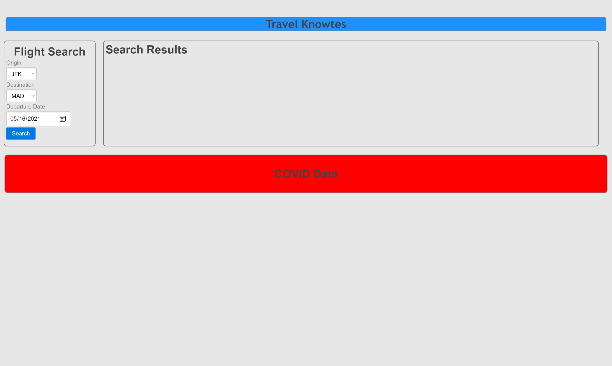

# Travel Knowtes

## Assignment
Create a weather dashboard using the OpenWeather API to fetch today's weather and a 5 day forecast along with a search history

### User Story

```
As a prospective traveler,
I want to find available flights
And I want to see COVID-19 info based on my search
So that I can plan a trip safely
```

### Acceptance Criteria

```
GIVEN a weather dashboard with form inputs
WHEN I search for a city
THEN I am presented with current and future conditions for that city and that city is added to the search history
WHEN I view current weather conditions for that city
THEN I am presented with the city name, the date, an icon representation of weather conditions, the temperature, the humidity, the wind speed, and the UV index
WHEN I view the UV index
THEN I am presented with a color that indicates whether the conditions are favorable, moderate, or severe
WHEN I view future weather conditions for that city
THEN I am presented with a 5-day forecast that displays the date, an icon representation of weather conditions, the temperature, and the humidity
WHEN I click on a city in the search history
THEN I am again presented with current and future conditions for that city
```

## Technologies Used
Project is created with:
* HTML/CSS
* Javascript
* AmadeusAPI
* NarrativaAPI
* Moment.js
* Pure.CSS

### Team
* Cyron Fraser
* Ryan Wheeler

### Site Image


### Link to Live Page
https://ortizalex.github.io/Travel-Knowtes/

### Concept

```
Title: Travel Knowtes
Story: As a prospective traveler, I would like to find available flights as well as real-time COVID-19 info
Description: A flight search app that displays up to date COVID info
Diagrams: https://github.com/OrtizAlex/Project/blob/main/Project%20Diagram.svg
Tech: Amadeus API and Narrativa API
Languages Used: HTML, CSS, Javascript
Framework: Pure.CSS
```